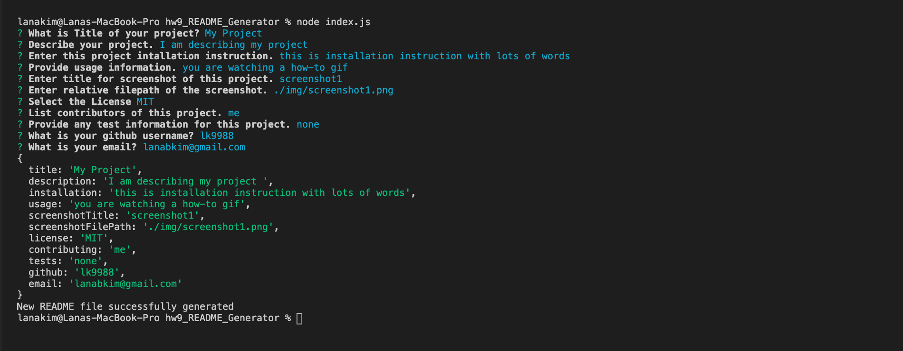

# my project

  ## Description

  I am describing my project with lots of words 

  ## Table of contents
  - [Installation](#Installation)
  - [Usage](#Usage )
  - [Licens](#License )
  - [Contributing](#Contributing)
  - [Test](#Test )
  - [Question](#Question )
 

  ## Installation 

  This is installation instruction with lots of words 

  ## Usage 

  You are watching q how-to gif

  
  
  ## License 
  
  )

  ## Contributing

  me

  ## Test 

  undefined

  ## Question 

  My GitHub: https://github/lk9988

  Email: <lanabkim@gmail.com> 

